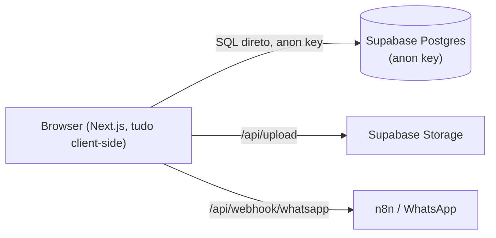
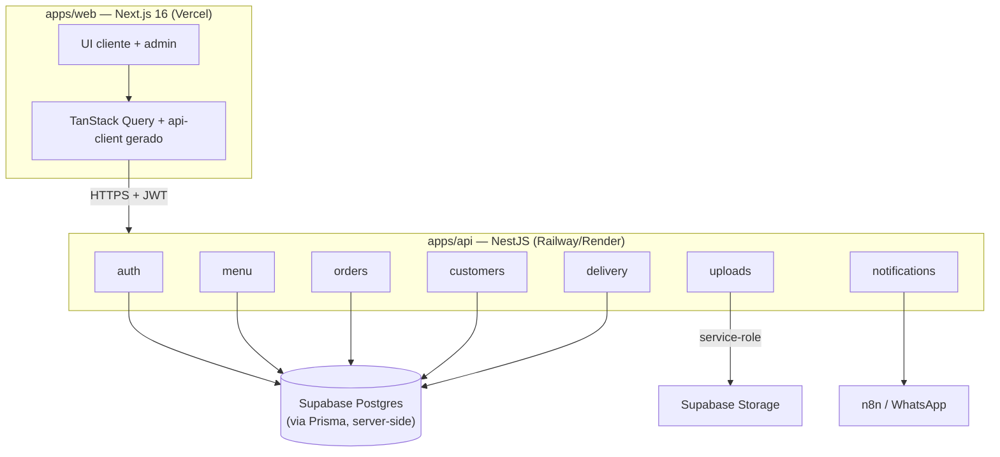
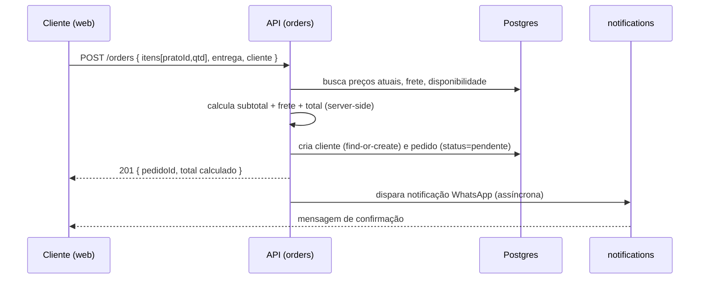

# Arquitetura — Hermes Marmitaria

## Visão

Sistema de pedidos de marmitaria com duas superfícies: **loja do cliente** (cardápio →
carrinho → checkout → rastreio) e **painel administrativo** (pedidos, cardápio,
financeiro). O objetivo da reestruturação é sair de um app V0 client-side para uma
arquitetura com backend próprio, segura e escalável.

## Estado atual (baseline) — diagnóstico

Problemas críticos (ver ADRs 0002, 0005, 0006):
1. Auth admin falsa (credenciais hardcoded + flag em `localStorage`).
2. Banco acessado do browser com anon key; autorização só via RLS não versionada.
3. Preço do pedido calculado no cliente e inserido direto no banco.
4. Rastreio baixa a tabela inteira de pedidos e filtra no cliente (vazamento).

## Arquitetura alvo — containers

Princípios:
- O **browser nunca fala com o banco**; só com a API do Nest (HTTPS + JWT).
- **Contratos** gerados do OpenAPI do Nest (`packages/api-client`) — ADR-0004.
- Segredos e regra de negócio **apenas no servidor**.

## Fluxo de criação de pedido (alvo)

O total exibido no cliente é uma **estimativa**; o valor oficial é o retornado pela API.

## Deploy (alvo)

| Camada | Plataforma |
|--------|-----------|
| `apps/web` | Vercel |
| `apps/api` | Railway / Render / VPS |
| Postgres | Supabase |
| Storage | Supabase Storage |

Deploys independentes (ADR-0001/0002). Ver Fase 6 do roadmap.
