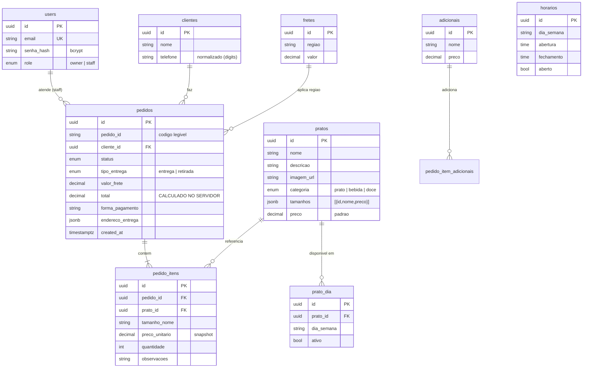
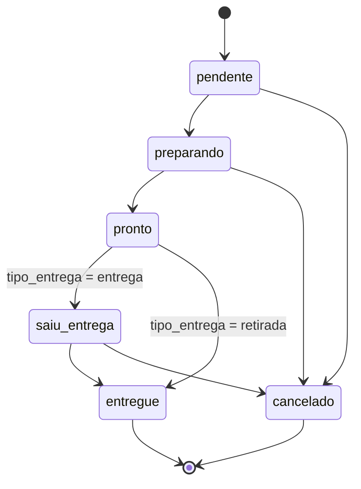

# Modelo de Domínio — Hermes Marmitaria

Modelo alvo do backend NestJS + Prisma. Nomes de entidade em português (domínio), campos
em `snake_case` no banco (padrão Postgres/Supabase existente).

## Entidades e relações

## Nota de modelagem: itens do pedido

Hoje `pedidos.itens` é um blob JSON denormalizado (nomes e preços copiados). Para o alvo,
propomos **normalizar** em `pedido_itens` (+ `pedido_item_adicionais`), guardando um
**snapshot** de `preco_unitario` no momento do pedido (o preço do cardápio pode mudar
depois). Isso habilita relatórios financeiros confiáveis (Fase 5/6). Decisão a confirmar
na Fase 3 ao rodar `prisma db pull` e ver o schema real.

## Máquina de estados do pedido

Regras:
- Transições de status são **operações do admin** (guard `RolesGuard`), exceto a criação
  (`pendente`), feita pelo cliente.
- `saiu_entrega` (hoje `"entrega"` no código) só se aplica a `tipo_entrega = entrega`.
- `cancelado` e `entregue` são estados finais.
- Cada transição registra `updated_at`; considerar histórico de status na Fase 6 se
  houver requisito de auditoria (não agora — ADR-0007).
